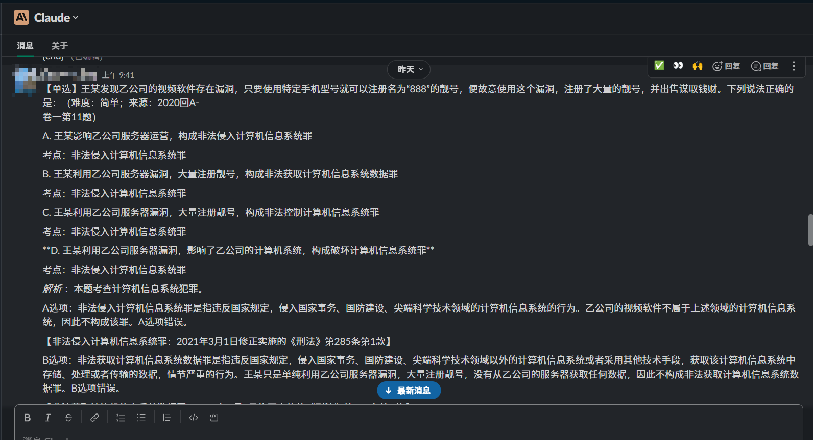
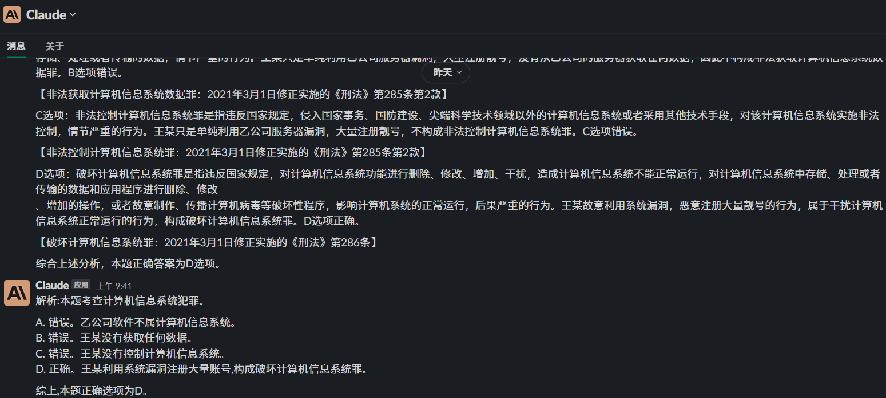

# slack-claude-for-LawExam

通过 Slack API 来使用 Claude，并完成批量刷题，让AI提炼精简原来的答案解析。

本代码以中国法律资格考试的真题和答案解析为例，可以批量逐题发送text到claude，并对返回值处理，生产新的答案解析。

注意：claude等LLM能生成怎么样的答案解析，在于你给它的prompt质量。建议先发个prompt给claude bot，再执行main.py。

`.env.template` 重命名为 `.env` 并填入 Slack APP Token 和 Claude Bot ID

## 运行

```bash
pip install -r requirements.txt

python main.py
```


## 示例





## 参考

* [jasonthewhale/Claude\_In\_Slack\_API](https://github.com/jasonthewhale/Claude_In_Slack_API)
* [yokonsan/claude-in-slack-api: claude in slack api](https://github.com/yokonsan/claude-in-slack-api)
* [Claude｜媲美ChatGPT，如何免费接入到个人服务](https://mp.weixin.qq.com/s?__biz=Mzg4MjkzMzc1Mg==&mid=2247483961&idx=1&sn=c009f4ea28287daeaa4de17278c8228e&chksm=cf4e68aef839e1b8fe49110341e2a557e0b118fee82d490143656a12c7f85bdd4ef6f65ffd16&token=1094126126&lang=zh_CN#rd)
